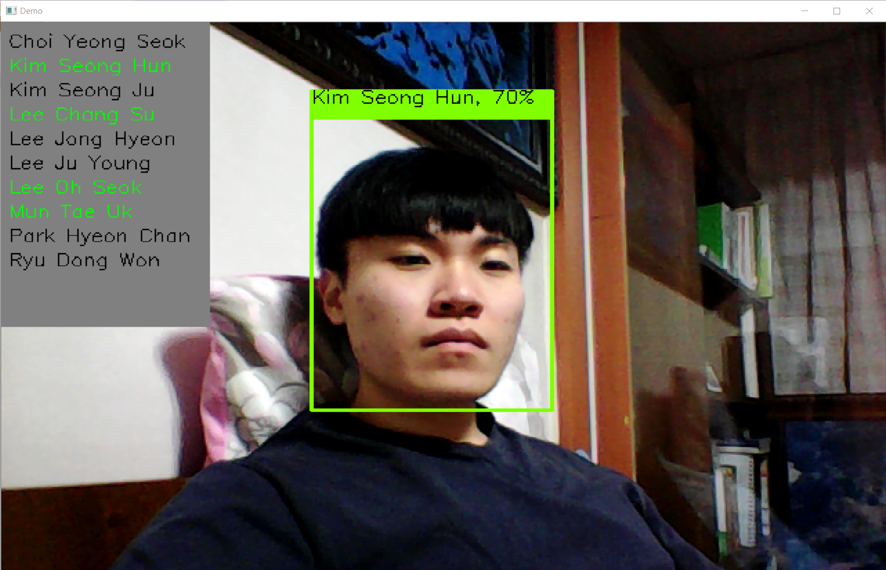
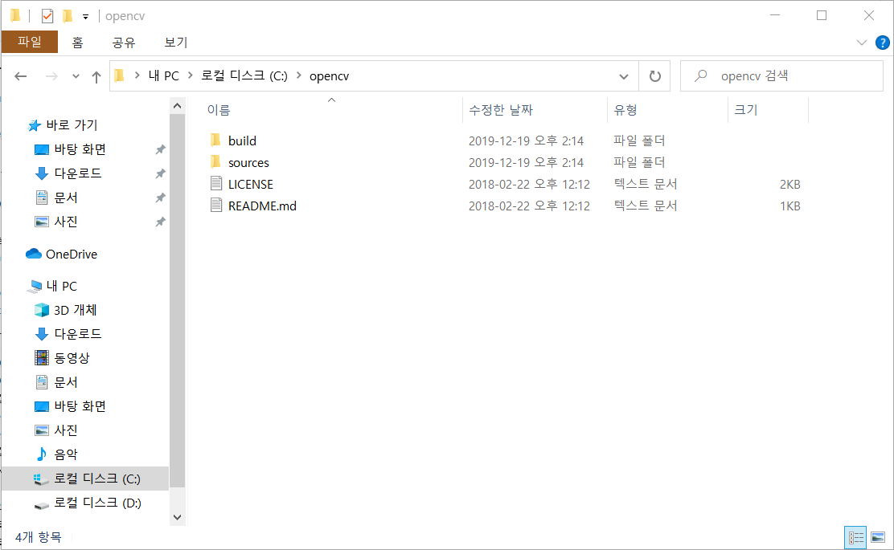
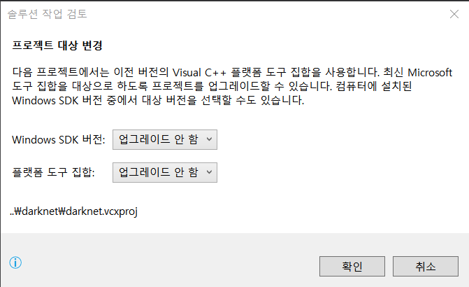
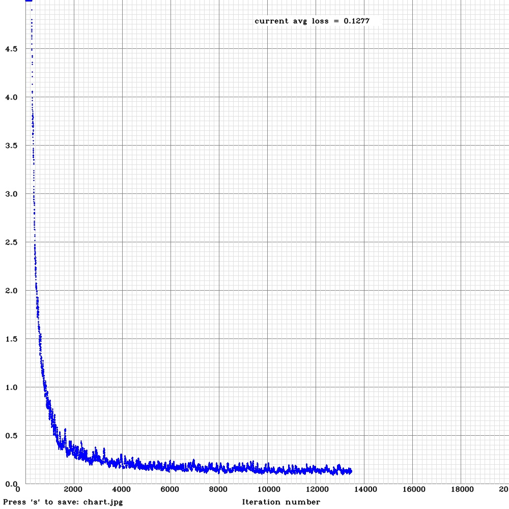

# face_recognition_yolo

**AlexeyAB**의 [darknet] 레포지토리를 설치 후 일부 파일을 수정한 패키지입니다. 학습시킨 인물 레이블을 실행화면에 나타나도록 하고 특정 인물을 인식하면 출석 체크를 하도록 수정하였습니다. 아래 구동에 필요한 프로그램 설치 후 빌드하고 사용할 수 있습니다.
작성 당시(19.12.22) **AlexeyAB**의 darknet 레포지토리의 원본 패키지에 덮어쓰시면 빌드 오류가 발생하니 참고하시기 바랍니다.

## requirements
VS, CUDA, cuDNN, openCV를 설치합니다.

참고 (실행한 환경)
  - Windows 10 Home
  - i5 7300hq
  - 8gb ddr4
  - gtx1050 2gb
_________________________________________________________________________________
  - Visual Studio 2017 [설치 링크 1] [ [참조 링크 1],  [참조 링크 2] ]
  - CUDA 10.2  [설치 링크 2]
  - cuDNN 7.6.5 for CUDA 10.2  [설치 링크 3] 
    - 압축을 풀고 생성된 디렉터리들을 CUDA 설치 디렉터리에 복사합니다. 
    - ex) C:\Program Files\NVIDIA GPU Computing Toolkit\CUDA\v10.2)
  - OpenCV 2.4.13.6 [설치 링크 4]
    - 압축을 풀고 생성된 폴더를 C: 에 위치시킵니다. 폴더이름은 opencv로 지정합니다.
    
    - 시스템 환경 변수에 OPENCV_DIR 이름으로 opencv path를 등록합니다.
________________________________________________________________________________
최초 darknet.sln을 열때 나타나는 솔루션 작업은 다음과 같이 **업그레이드 안함**으로 진행합니다.

  
[darknet]: https://github.com/AlexeyAB/darknet/
[설치 링크 1]: https://docs.microsoft.com/ko-kr/visualstudio/releasenotes/vs2017-relnotes
[설치 링크 2]: https://developer.nvidia.com/cuda-downloads
[설치 링크 3]: https://developer.nvidia.com/rdp/form/cudnn-download-survey
[설치 링크 4]: https://opencv.org/releases/

[참조 링크 1]: https://murra.tistory.com/100
[참조 링크 2]: https://todaybbs.tistory.com/2

## training data
- 10명의 학생 얼굴 이미지 4500여장을 학습시켰습니다. (명당 4~500장)
- cfg/yolov3-tiny-obj.cfg
  - batch : 32
  - subdivisions : 32
  - max batches : 20000 (10 * 2000)
  - steps : 16000, 18000 (80%, 90% of max batches)
- 학습 결과 (cost)

